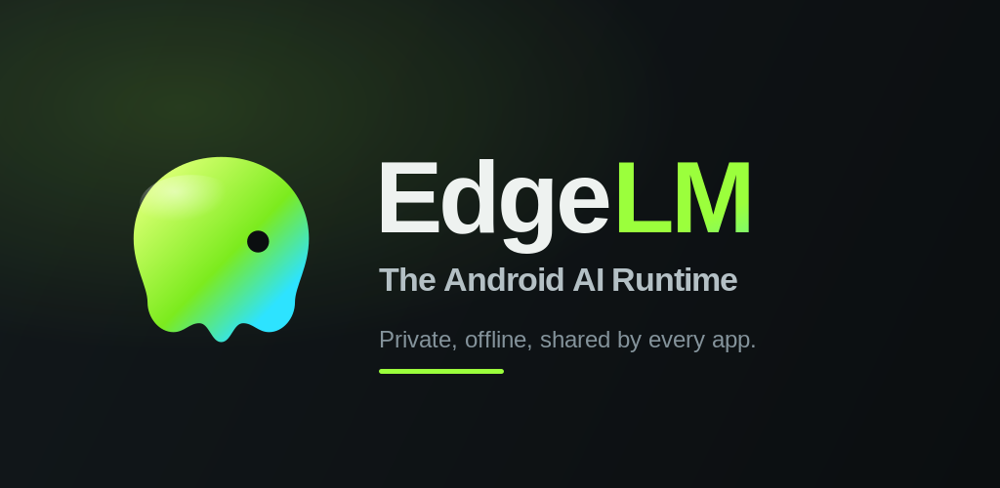
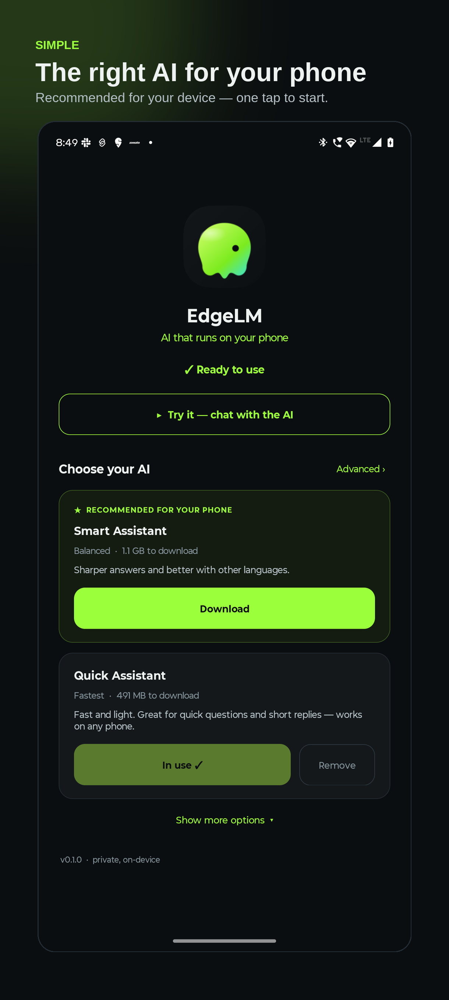
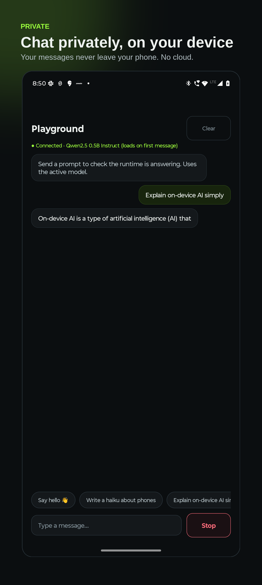
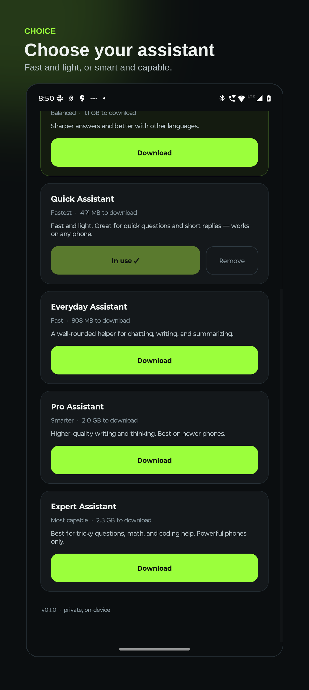
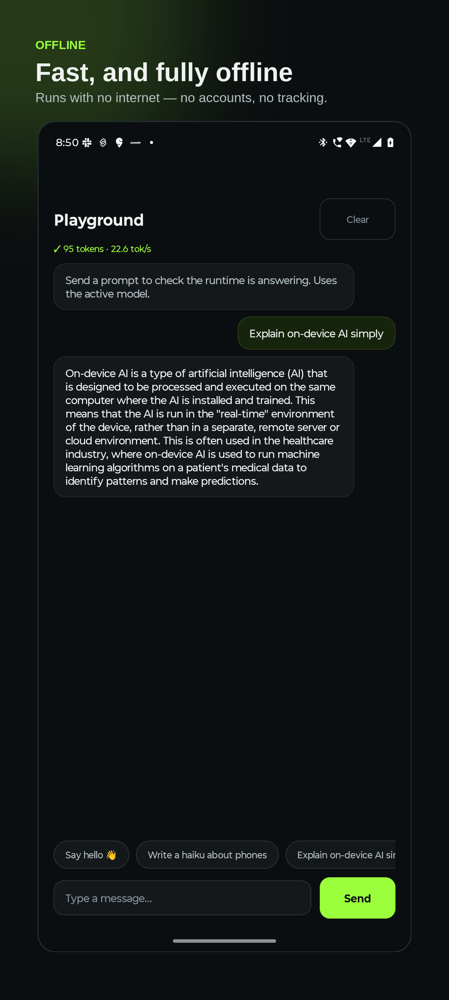
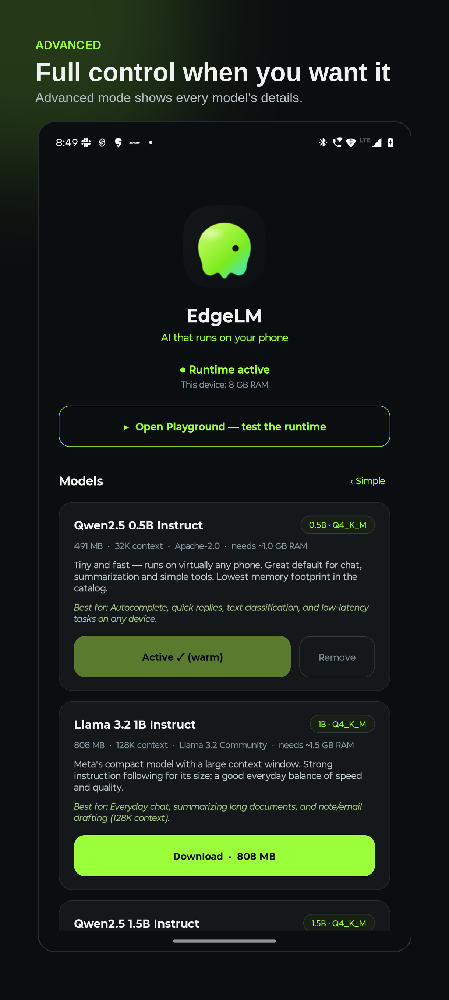

# EdgeLM — AI that runs on your phone

<p align="center">
  
</p>

<p align="center">
  <a href="https://play.google.com/store/apps/details?id=ai.edgelm.runtime">
    
  </a>
</p>

<p align="center">
  <a href="https://play.google.com/store/apps/details?id=ai.edgelm.runtime"></a>
  <a href="https://play.google.com/store/apps/details?id=ai.edgelm.runtime"></a>
  
  
  
</p>

EdgeLM is a shared, on-device AI runtime for Android. It runs language models
**directly on your phone** — privately, offline, and shared by every app that wants to
use AI. Download a model once, and any EdgeLM-powered app can use it, instead of each
app bundling and running its own.

Think of it as a system service for on-device intelligence: one place that holds the
model, so your apps get AI without sending your data to the cloud.

## Screenshots

<p align="center">
  
  
  
  
  
</p>

## Why EdgeLM

- **Private by design.** Your prompts and the AI's responses never leave your device.
  No cloud, no account, no tracking, no ads.
- **Works offline.** Once a model is downloaded, EdgeLM runs with no internet at
  all — the same on a plane, in a tunnel, or on airplane mode.
- **Shared and efficient.** EdgeLM loads a model once and serves every app from that
  single copy, so a second app adds almost no extra memory.
- **No cloud cost, no round-trips.** Nothing to pay per request, and no waiting on a
  network.

## How it works

1. **Install EdgeLM Runtime** and follow the quick welcome.
2. **Pick an AI.** EdgeLM recommends the right model for your phone — one tap to
   download. Prefer to choose yourself? Switch to Advanced for the full catalog.
3. **Use it.** Try it right away in the built-in playground, and any EdgeLM-powered app
   on your phone can now use on-device AI.

A small, always-available notification shows when the runtime is active, lets you free
up memory on demand, and the runtime automatically releases memory when idle.

## Choose your model

A curated catalog spans tiny-and-fast to more capable, each shown with a plain-language
description, size, and what it's best for — with a warning if your phone may not have
enough memory:

| In the app | Model | Good for |
|---|---|---|
| Quick Assistant | Qwen2.5 0.5B | Fast, light — quick questions on any phone |
| Everyday Assistant | Llama 3.2 1B | Chatting, writing, summarizing |
| Smart Assistant | Qwen2.5 1.5B | Sharper answers, better multilingual |
| Pro Assistant | Llama 3.2 3B | Higher-quality writing and thinking |
| Expert Assistant | Phi-3.5 mini | Tricky questions, math, coding help |

Keep several installed and switch between them instantly, with no re-download.

## Privacy

EdgeLM collects no personal data. Prompts and responses are processed on your device
and are never stored or sent anywhere. The only time EdgeLM uses the network is to
download the model you choose. Full policy: [`docs/play/PRIVACY.md`](docs/play/PRIVACY.md).

## For developers

Add on-device AI to your app in a few lines — no model weights to ship or manage.

**1. Add the SDK** (via [JitPack](https://jitpack.io/#Chandra-Mauli-Sharma/EdgeLM)):

```kotlin
// settings.gradle.kts
repositories { maven { url = uri("https://jitpack.io") } }

// app/build.gradle.kts
implementation("com.github.Chandra-Mauli-Sharma.EdgeLM:sdk:0.1.0")
```

**2. Stream tokens** (a cold `Flow<String>`; the runtime app must be installed):

```kotlin
EdgeLM.initialize(context)
EdgeLM.chat(model = "default", prompt = "Hello", sessionId = "chat-1")
    .collect { token -> /* stream */ }
```

The permission and package visibility come in automatically via manifest merge, and the
runtime serves apps by priority. **Full guide: [`docs/INTEGRATION.md`](docs/INTEGRATION.md)**
· architecture & release kit in [`docs/`](docs/).

---

*On-device. Private. Offline. Shared by every app.*
